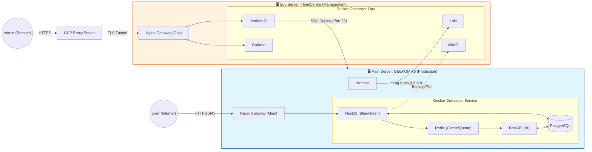

---
tags:
  - project
  - Resources
  - ProtoStar
  - 기획
  - Architect
parent notes:
  - "[[MasterNote - ProtoStar]]"
---
# 📜 Project Protostar: 고가용성 온프레미스 AI 서비스 통합 아키텍처 전략 보고서(v2.2.1)

## 1\. 개요 (Executive Summary)

본 프로젝트는 \*\*'Project Protostar'\*\*의 비즈니스 목표(AI 기반 HR 서비스)를 계승하며, 1인 개발 리소스의 한계를 극복하기 위해 인프라 복잡도를 최적화한 \*\*'Project Protostar'\*\*로 재정의된다.
기존 Kubernetes(V2.1) 도입 시도에서 확인된 오버헤드를 제거하고, \*\*"AWS ECS 아키텍처와 호환성을 갖춘 고도화된 온프레미스 Docker 환경"\*\*을 구축하여 **실리적 엔지니어링(Pragmatic Engineering)** 역량을 증명한다.

* **핵심 변경:** Kubernetes(MicroK8s), Spring Framework, ArgoCD 제거 ➡ **Docker Compose, NestJS/FastAPI, Jenkins 집중.**
* **유지 전략:** 물리적 서버 분리(Main/Sub), 이원화된 네트워크(Dual Path), AI/RAG 비즈니스 로직, 보안 프로토콜.

-----

## 2\. 성공 지표 (KPI) - Refined

1. **인프라의 물리적 격리 및 안정성:** 서비스(A5)와 관리(Centre) 리소스의 완벽한 물리적 분리를 통한 '간섭 없는 운영'.
2. **실리적 무중단 배포 (Blue/Green):** 복잡한 ArgoCD 대신, **Nginx와 Docker Compose, Shell Script**를 활용한 가볍고 확실한 무중단 배포 파이프라인 구축.
3. **데이터 파이프라인의 통합 및 고속화:** Redis(BullMQ)를 활용하여 HTTP 요청과 비동기 작업을 매끄럽게 연결하고, PostgreSQL 하나로 벡터와 관계형 데이터를 통합 관리.
4. **보안 터널링 유지:** GCP를 활용한 관리망 우회(TLS Passthrough) 및 내부 서비스 접근 제어.
5. **AI 응답성 최적화:** FastAPI와 Redis 큐를 통한 비동기 임베딩 처리로 사용자 대기 시간 최소화.

-----

## 3\. 하드웨어 및 인프라 구성 (Physical Architecture)

V2.1의 하드웨어 역할을 그대로 유지하되, OS 위의 구동 레이어를 K8s에서 Docker로 변경한다.

### Server A: Production Zone (The Battlefield)

* **하드웨어:** GEEKOM A5 (Ryzen R5-7430U, 32GB RAM)
* **역할:** 실제 유저 트래픽 처리 및 고성능 연산.
* **소프트웨어 스택 (Docker Compose):**
  * **Gateway:** `Nginx` (Main Router, SSL Termination)
  * **App:** `NestJS` (Blue/Green Set), `FastAPI` (AI Worker)
  * **Data:** `PostgreSQL` (Vector included), `Redis` (Cache/Queue)
  * **Agent:** `Promtail` (로그 수집), `cAdvisor`, `Node-exporter`

### Server B: Management Zone (The Control Tower)

* **하드웨어:** ThinkCentre (Ryzen 3400GE, 16GB RAM)
* **역할:** 배포 통제, 모니터링, 정적 파일 저장, 관리망 우회 접속.
* **소프트웨어 스택 (Docker Compose):**
  * **Gateway:** `Ops-Nginx` (GCP Stream Proxy 수신)
  * **CI/CD:** `Jenkins` (DooD Build, SSH Deploy)
  * **Storage:** `MinIO` (S3 호환, 백업 및 정적 파일)
  * **Observability:** `Loki` (로그 중앙 저장), `Prometheus`, `Grafana`

### Server C: Network Proxy

* **인프라:** GCP Free Tier (e2-micro)
* **역할:** 관리자 접속용 우회 경로 제공 (TLS Passthrough + Proxy Protocol).

-----

## 4\. 네트워크 전략: Dual Path (V2.1 계승)

단일 가정용 IP의 한계를 극복하고 보안을 강화하기 위해 트래픽 성격에 따라 경로를 물리적으로 분리하는 전략은 유효하다.

| 경로 구분 | 트래픽 흐름 | 특징 |
| :--- | :--- | :--- |
| **Path A: Service (Direct)** | User ➡ Router(443) ➡ **A5 Nginx** | 지연 시간 최소화, 서비스 전용 대역폭 사용. |
| **Path B: Mgmt (Bypass)** | Admin ➡ GCP(443) ➡ Router(8888) ➡ **Centre Nginx** | 포트 포워딩 회피, **GCP TLS Passthrough**로 보안 유지. |



-----

## 5\. MSA 및 데이터 전략 (Tech Stack Shift)

복잡한 폴리글랏(Spring 혼용)을 버리고, **TypeScript(Node.js)와 Python**의 강점을 극대화하는 구조로 단순화한다.

### 5.1. 서버 구성 및 역할

* **NestJS (Main Backend):**
  * 역할: API Gateway 역할 수행, 인증/인가(Auth), 유저 관리, 채팅 비즈니스 로직.
  * 통신: FastAPI와는 직접 통신하지 않고 \*\*Redis(BullMQ)\*\*를 통해 느슨하게 결합.
* **FastAPI (AI Worker):**
  * 역할: RAG 파이프라인, 임베딩 생성, LLM 호출 추상화.
  * 동작: Redis 큐를 구독(Subscribe)하고 있다가 작업 처리 후 결과 업데이트.

### 5.2. 데이터 저장소 통합 (Data Locality)

V2.1의 핵심 사상인 \*\*"서비스 구동 위치에 데이터 배치"\*\*를 따른다.

* **PostgreSQL (A5):** 유저 정보(Relational) + 벡터 임베딩(pgvector) + 대화 로그(JSONB)를 단일 인스턴스에서 관리하여 트랜잭션 정합성 확보.
* **Redis (A5):** 세션 스토어, API Rate Limit, **비동기 작업 큐(Message Broker 대체)** 역할을 전담.
* **MinIO (Centre):** 무거운 정적 파일(이미지, PDF)은 물리적으로 분리된 Centre 서버에 저장하여 A5의 I/O 부하 경감.

-----

## 6\. 배포 파이프라인 (CI/CD)

ArgoCD를 제거하고 **Jenkins와 Shell Script**를 활용한 'Push' 방식의 배포로 전환한다.

### 레포지토리 전략 (4-Repo)

1. **Protostar-Infra (Ops):** `docker-compose.yml`, `nginx.conf`, `deploy.sh` 등 인프라 코드 일체.
2. **Protostar-Backend (NestJS)**
3. **Protostar-AI (FastAPI)**
4. **Protostar-Web (Next.js)**

### 배포 시나리오 (Jenkins Pipeline)

1. **Build:** Jenkins(Centre)에서 Docker Image 빌드 (DooD 활용, 캐시 최적화).
2. **Config Sync:** `Nova-Infra` 레포지토리의 최신 설정(환경변수 등)을 로드.
3. **Deploy (SSH to A5):**
      * 새 이미지를 A5 서버로 Pull.
      * **Blue/Green Script 실행:**
          * 현재 구동 중인 컨테이너 색상(예: Blue) 확인.
          * 반대 색상(Green) 컨테이너 `up`.
          * Health Check 통과 시 Nginx 설정 변경 및 Reload.
          * 이전 색상(Blue) 컨테이너 `down`.

-----

## 7\. 주요 기술적 대응 전략 (Risk Management)

### 7.1. 인증 정보 및 유저 컨텍스트 전달 (Identity Propagation)

* **Gateway 부재의 대안:** Spring Gateway가 사라졌으므로, **NestJS의 AuthGuard**가 진입점 역할을 수행한다.
* **AI 서버 전달:** NestJS가 Redis 큐에 작업을 넣을 때, `{ userId, role, message }` 등의 메타데이터를 함께 Payload에 담아 FastAPI가 작업 주체를 식별할 수 있도록 한다.

### 7.2. 프로토콜 파편화 대응 (Protocol Fragmentation)

* **Envelope Pattern 유지:** NestJS와 FastAPI가 서로 다른 언어지만, 응답 포맷은 통일한다.

    ```json
    {
      "resultCode": "SUCCESS",
      "data": { ... },
      "message": "User friendly message"
    }
    ```

* FastAPI의 에러도 위 포맷으로 래핑하는 `Exception Handler`를 반드시 구현한다.

### 7.3. 빌드 리소스 관리

* **Jenkins 제한:** Centre 서버의 16GB 램 보호를 위해 Jenkins의 동시 실행 수(Executor)를 1개로 제한하여 OOM(Out Of Memory) 방지.

-----

## 8\. 소프트웨어 상세 및 로직 (V2.1 계승)

인프라는 변경되었으나, 그 위에서 돌아가는 애플리케이션의 로직은 V2.1의 기획을 따른다.

* **성장형 권한 체계:** Guest ➡ Stargazer ➡ Protostar 단계별 권한 상승 로직을 NestJS Guard로 구현.
* **AI 비용 최적화:** `gpt-oss-120b` 등 로컬/저비용 모델 활용 시도 및 Gemini API 하이브리드 운영.
* **프론트엔드 전략:**
  * 선행 프로젝트 \*\*'AI 심리 테스트'\*\*를 통해 Next.js + FastAPI 통신 사전 검증.
  * 이후 메인 HR 챗봇 서비스로 확장.

-----

## 💡 Architect's Note: 전환의 의의

**Project Protostar**는 단순한 스펙 다운(Spec-down)이 아닙니다. 이는 **"비즈니스의 본질(AI 서비스)"에 집중하기 위해 "도구(인프라)"를 통제 가능한 범위로 재조정하는 성숙한 엔지니어링의 과정**입니다.

* **버린 것:** 과도한 추상화(K8s), 분산 트랜잭션의 복잡함, 관리의 피로도.
* **얻은 것:** 확실한 데이터 지역성, 직관적인 디버깅 환경, 그리고 **AI 로직을 고도화할 수 있는 시간.**

준비된 하드웨어와 새로운 설계도를 바탕으로, 내일(D-Day)부터 즉각적인 구축을 시작합니다. 🚀
